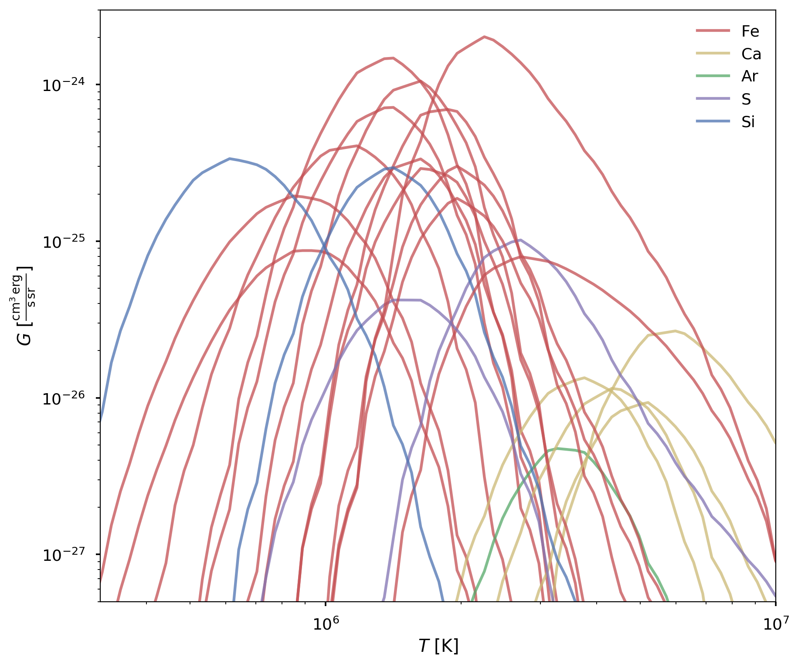
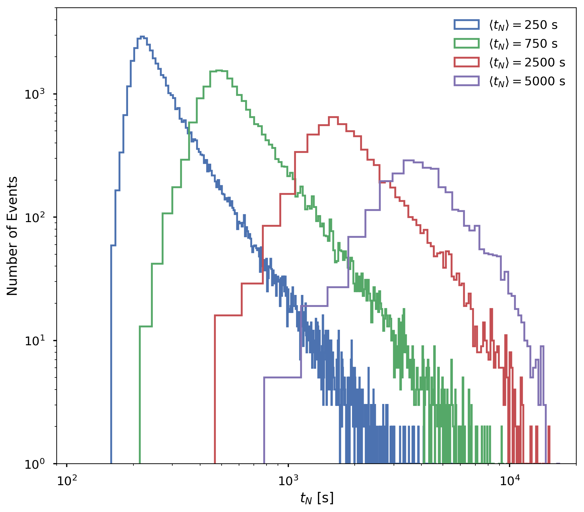

title: Constraining Nanoflare Heating Frequency with a Global Active Region Model
class: animation-fade
layout: true

<!-- This slide will serve as the base layout for all your slides -->
.bottom-bar[
  <a href="https://wtbarnes.github.io/loops-workshop-2017-talk/" style="color:#f8f8f8;">wtbarnes.github.io/loops-workshop-2017-talk</a>
  
]

---

class: impact
background-image: url("img/Rice_University_seal.svg.transparent.png")
background-size: contain
background-blend-mode: overlay;

# {{title}}
## Will Barnes, Stephen Bradshaw
### Rice University, Houston, TX USA
## 8th Coronal Loops Workshop &ndash; Palermo, Italy
### 28 June 2017

---
class: top

# Heating Frequency in AR Cores
.col-8[
* What is the frequency of nanoflares in AR cores?
* Define heating frequency in terms of `\(t_N\)`
  * `\(t_N<\tau_{cool}\)` &ndash; *high-frequency heating*
  * `\(t_N>\tau_{cool}\)` &ndash; *low-frequency heating*
* Emission measure slope `\(\mathrm{EM}\sim T^a\)`, `\(6.0<\log{T}<\log{T_{peak}}\)` often used as a diagnostic for heating frequency
* Many factors hinder interpretation
  * Multiple emitting structures along the LOS
  * Nonequilibrium ionization
  * Inversion techniques for finding EM
  * Lack of spectral coverage in detectors
]
.col-4[

]

???
Motivation, past studies, what does the slope tell us

EM slope gives a measure of ratio of cool to warm plasma

Steeper (shallower) slope, less (more) cool plasma, high (low) frequency heating

Mention our previous papers, what did they tell us

`\(t_N\)` is the time between successive impulsive heating events on a *single strand*

is high or low or intermediate frequency or all of the above?

---
class: middle

## Two primary questions:
- ### What are the observational signatures of nanoflares of varying frequency?
- ### Are these signatures detectable?

---

# Forward Modeling Global Active Regions
* `synthesizAR` &ndash; a Pure-python pipeline for producing forward-modeled instrument data products from field-aligned loop hydrodynamics
* Relies heavily on the widely-used and well-documented scientific Python stack
* Workflow
 * Select HMI observation of an AR and perform field extrapolation
 * Configure loop simulations from field extrapolation results
 * Load simulation ouput and map to fieldlines
 * Synthesize emission for each spatial point and timestep
 * Project along LOS and output data product (e.g. FITS)
* Build up a global active region model from an ensemble of hydrodynamic loop models

???
Global = not just one isolated loop but an ensemble of loops representing an AR ("global" here does not mean the whole Sun or even the whole disk)

Customizable for any type of loop code and instrument

In particular, SunPy for preserving coordinate systems, coordinate transformations

CHIANTI/ChiantiPy for all atomic data

It would be nice to provide a flow chart of the code, e.g. using networkx or something like that

---
class: top

# Model Setup
.col-6[
* Use AR NOAA 1109 (#9 in Table 1 [Warren et al., 2012][warren_systematic_2012]) from 29 September 2010
* Model 10<sup>3</sup> independently evolving fieldlines with two-fluid EBTEL model for ≈2&times;10<sup>4</sup> s
* Calculate emission from *all* ions in the CHIANTI database (AIA)
* Synthesize *wavelength-resolved* intensity for 22 transitions (EIS)
* Repeat for four different average waiting times, $$ \langle t_N\rangle=250,750,2500,5000\,\,\mathrm{s}$$
]
.col-6[
  
]

???

Pare down text in this slide, remove AIA images on previous slide. They aren't really needed and could be confusing

What our goal is: constrain heating parameter space by comparing global models with *many* reported observations (statistically more powerful)

What our goal is not: reproducing every feature of *specific* observations *exactly*

Left panels are **observed** AIA images for channels 94 and 131

Trace 1000 fieldlines through extrapolated field

Require that they are between Mm and Mm

Only closed field

---
# Hydrodynamic Loop Model
Two-fluid EBTEL model of [Barnes et al. (2016a)][barnes_inference_2016a],

\begin{align}
\frac{dp\_e}{dt} =& \frac{\gamma - 1}{L}(\psi\_{TR} - (\mathcal{R}\_{TR} + \mathcal{R}\_C)) + k\_Bn\nu\_{ei}(T\_i - T\_e) + (\gamma - 1)Q\_e \\\\
\frac{dp\_i}{dt} =& -\frac{\gamma - 1}{L}\psi\_{TR} + k\_Bn\nu\_{ei}(T\_e - T\_i) + (\gamma - 1)Q\_i \\\\
\frac{dn}{dt} =& \frac{c\_2(\gamma - 1)}{c\_3\gamma Lk\_BT\_e}(\psi\_{TR} - F\_{ce,0} - \mathcal{R}\_{TR}) \\\\
p\_e =& k\_BnT\_e,\quad p\_i = k\_BnT\_i
\end{align}

Heat electrons or ions *dynamically* and model *spatially-averaged coronal* quantities

???
For this setup,  use two-fluid EBTEL model described in appendix of Barnes et al. (2016a)

Spatially-average energy and mass equations for electrons and ions, assuming quasi-neutrality
---
class: top

## Spectroscopic Details

.col-6[
  
]
.col-6[

| Ion         | Wavelength  | Ion         | Wavelength   |
|:------------|:------------|:------------|:-------------|
|    S X      |   264.2306  |    Si X     |  258.374     |
|    Fe X     |   184.537   |    Fe XII   |  195.119     |
|    Fe IX    |   188.493   |    Fe IX    |  197.854     |
|    Fe XII   |   192.394   |    Fe XVI   |  262.976     |
|    Fe XI    |   180.401   |    S XIII   |  256.6852    |
|    Ca XV    |   200.9719  |    Fe XV    |  284.163     |
|    Fe XIII  |   202.044   |    Fe XIV   |  264.7889    |
|    Fe XIII  |   203.826   |    Ca XVI   |  208.585     |
|    Fe XIV   |   270.5208  |    Fe XI    |  188.216     |
|    Ca XVII  |   192.8532  |    Si VII   |  275.3612    | 
|    Ca XIV   |   193.8661  |    Ar XIV   |  194.401     |   
]

???
Select spectral lines consistent with AR 9 studied by Warren et al to give good temperature coverage

When synthesizing AIA images, use all ions in CHIANTI

Use coronal abundances of Feldman et al. (1992)

---

## Heating Parameter Space

.col-6[
* Each strand heated independently
* Preferentially heat electrons
* Triangual pulses with duration `\(\tau=200\,\,\mathrm{s}\)`
* Total input energy per strand set by $$E = \frac{(\epsilon B)^2}{8\pi}$$ 
* Event energies chosen from a power-law distribution with `\(\alpha=-2.5\)`
* `\(t_{N,i}\propto E_i\)` such that larger events require a longer "winding time"
]

.col-6[

]

???
`\(B\)` is determined from the field extrapolation and `\(\epsilon=0.1\)`

---
class: full,middle,center
background-image: url("img/temperature_density_profiles.png")
background-size: contain
---

# Emission Measure Diagnostics
* *True* emission measure from simulated thermodynamic quantities, $$\mathrm{EM}(T) = \int_{\mathrm{LOS}}\mathrm{d}h\,n^2(h,T)$$ 
* Bin in temperature `\(5.6<\log{T}<7.0\)` with width `\(\Delta\log{T}=0.05\)`
* *Predicted* EM from regularized inversion code of [Hannah and Kontar (2012)][hannah_differential_2012]
  * Assume 25% uncertainty on our intensities to balance acceptable `\(\chi^2\)` and smoothness
  * Apply to pixel-averaged **and** full AR
* Fit power-law to cool side such that `\(\mathrm{EM}\sim T^a\)`
  * Fit between 1 MK and `\(T_{peak}\)` (4 MK true, 3 MK predicted), where `\(\mathrm{EM}_{max}=\mathrm{EM}(T_{peak})\)`
  * Only fit to pixels where `\(\mathrm{EM}(T)>10^{25}\)` cm<sup>-5</sup> and acceptable fit `\(R^2>0.95\)`

???
Integrated intensities for all 22 spectral lines as observed by EIS

HK12 gives us error bars in both temperature and emission measure
---

## Pixel-averaged Emission Measures

.col-6[
* [Warren et al. (2012)][warren_systematic_2012] constructed `\(\mathrm{EM}(T)\)` from pixel-averaged intensities in NOAA 1109 using MCMC
* Time-average integrated intensities (over 5000 s interval) for same set of spectral lines
* Compare predicted and true EM with predicted EM derived from reported intensities
]
.col-6[
  
]

???
Time-averaged integrated intensity for Fe XII 195.119

Blue box shows ROI over which we calculate pixel-average intensity

---
class: full,middle,center
background-image: url("img/em_true_predict_4panel.png")
background-size: contain

???
True EM peak ~4 MK in all cases while predicted EM peak ~3 MK. 

Why is this?

Note that very cool (well below 1 MK) and very hot (>8-9 MK) emission are unconstrained because of a lack of spectral information there

---
class: full,middle,center
background-image: url("img/em_true_predict_2panel.png")
background-size: contain

???
Bring attention to comparison with Warren results

Intensities reported by Warren et al processed through HK12 inversion routine

Decent agreement with t<sub>N</sub>=250 s solution though peak temperatures still offset

---
background-image: url("img/em_ar_true.gif")
background-size: contain

## Global AR Emission Measure &ndash; True

???
Emission measure distributions for idealized case for all four heating frequencies, i.e. density squared integrated along LOS

---
background-image: url("img/em_ar_predicted.gif")
background-size: contain

## Global AR Emission Measure &ndash; Predicted

???
Apply DEM inversion method to synthesized time-averaged intensities. Show 2D maps of EM for different frequencies and maps of EM slope. Do this for inverted and ground truth EM

---
background-image: url("img/em_slope_maps.png")
background-size: contain

## Emission Measure Slopes

---
background-image: url("img/em_slope_4panel.png")
background-size: contain

## Emission Measure Slopes

???
Compare distribution of EM slope values for two methods for all heating frequencies, show Warren result superimposed

---
class: full,middle,center
background-image: url("img/em_slope_2panel.png")
background-size: contain
---
class: full,middle,center
background-image: url("img/reported_slopes_with_results.png")
background-size: contain
---


# Conclusions
* Global active region modeling a powerful tool for studying dynamically-heated AR cores
  * Efficient
  * AR Geometry
  * Detailed loop physics (with 1D models)
  * Atomic physics and instrument effects
* Relationship between predicted `\(a\)` and `\(t_N\)` much "messier" compared to true `\(a\)`
* Predicted EM peak at lower temperatures than true EM, independent of heating frequency
* Predicted slopes for high-frequency case gives a relatively flat distribution &ndash; a reliable diagnostic?
* When computing model emission measure, forward model EIS lines and construct DEM region

???
* Future Work
  * Extend work to 1D field-aligned models, e.g. HYDRAD
  * Different observables, e.g. time lags, line widths, Doppler shifts

Statistical study of EM slopes in an observed AR and compare EM slope distributions

---
class: bottom

### Talk
* [github.com/wtbarnes/loops-workshop-2017-talk](https://github.com/wtbarnes/loops-workshop-2017-talk)

### Code
* [github.com/rice-solar-physics/ebtelPlusPlus](https://github.com/rice-solar-physics/ebtelPlusPlus)
* [github.com/wtbarnes/synthesizAR](https://github.com/wtbarnes/synthesizAR)

### Built With:
.col-3[
  </img>
]
.col-3[
  </img>
]
.col-4[
  </img>
]
.col-2[
  </img>

]

---
class: middle,center

# Supplementary Slides

---
# `synthesizAR` Example

```python
import 
```

[barnes_inference_2016a]: http://adsabs.harvard.edu/abs/2016arXiv160804776B
[warren_systematic_2012]: http://adsabs.harvard.edu/abs/2012ApJ...759..141W
[hannah_differential_2012]: http://adsabs.harvard.edu/abs/2012A%26A...539A.146H

